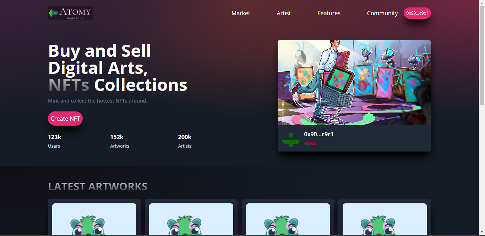

# A NFT Marketplace with React, Solidity and Infuria

You can see the Final Project Here -> 
Final view of Project! 

<center><figcaption>WEB3.0 NFT Marketplace</figcaption></center>

## Technology

This demo uses:

- Metamask
- Truffle
- Infuria
- ReactJs
- Tailwind CSS
- Ganache-CLI
- Solidity
- Web3js

## Running the demo

To run the demo follow these steps:

1. Clone the project with the code below.
    ```sh

    # Make sure you have the above prerequisites installed already!
    git clone Link Project_Name
    cd Project_Name 
    yarn install # or using NPM
    npm install  # To Install dependencies.
    ```
2. Create an Infuria project and update the variables in .env file
3. Update the `.env` file with the following details.
    ```sh
    REACT_APP_INFURIA_PID= ''
    REACT_APP_INFURIA_API=''
    ```
4. Run the command `yarn start` to run the App.
5. Create a new Terminal and run the following commands
    ```sh
    truffle migrate
    ganache-cli -d
    ```
5. Connect your website to Metamask and Change the network to LocalHost8545.
6. Create, Mint, List NFT's.  
<br/>

Initially there will be no NFTS, Mint/Create them.

## References :

- [Metamask](https://metamask.io/)
- [Truffle](https://trufflesuite.com/)
- [Infuria](https://infura.io/)
- [ReactJs](https://reactjs.org/)
- [Solidity](https://soliditylang.org/)
- [Web3Js](https://docs.ethers.io/v5/)
- [Ganache](https://trufflesuite.com/ganache/index.html)